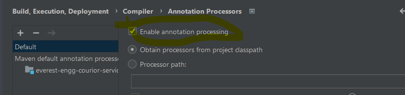

# Setting up code base

1. Have java 8 installed on machine.
2. Have IntelliJ installed.
3. Have maven installed.
4. Enable annotation processing. File menu --> Settings --> Build, execution, deployment --> compile --> annotation process and check  enable annotation processing
   
5. Wait for maven project to load, if not automatically done, right click on pom.xml and add as maven project.

# Delivery cost client
# Assumptions: 

1. Considered only positive inputs and no negative cases handled for inputs and hence the app will fail if any wrong inputs provided
2. The agenda of the project is concentrate on design aspect and write code that can be extendable to different offer codes
3. If offer code is invalid, no discount will be considered
4. User has to input all the needed inputs in appropriate datatype

# Setting up offers

Go to Utils and create new offer. For example below setup offer with code `OFR003` and criteria as 
distance should range between `50` to `250`, and weight range between `10` to `150` and call the method inside `prepareOffer`

    private static void prepareOffer3() {
        NumberRangeOfferCriteria dist50To250 = new NumberRangeOfferCriteria( RANGE,
        new Number[]{50, 250}, Package::getDist);
        NumberRangeOfferCriteria weight10To150 = new NumberRangeOfferCriteria(RANGE,
        new Number[]{10,150}, Package::getWeight);
        new Offer<Number,Number>("OFR003",5,new OfferCriteria[]{dist50To250,weight10To150});
    }

# Running
1. Run PackageChargeCalculatorApp class

2. Provide base delivery cost and number of packages

3. enter the package details with space separated and press enter after inputting package ID, weight, distance and offer code

4. After successful run, the app displays each package id, discount and charges to be paid.

# Package delivery time estimation

# Assumptions:

1. Considered only positive inputs and no negative cases handled for inputs and hence the app will fail if any wrong inputs provided
2. Concentrated on having a feasible solution, I believe the code can be improvised though I did my best to write understandable code.
3. If offer code is invalid, no discount will be considered
4. User has to input all the needed inputs in appropriate datatype

# Running

1. Run DeliveryEstimationApp class
2. Provide base delivery cost and number of packages
3. enter the package details with space separated and press enter after inputting package ID, weight, distance and offer code
4. enter no of vehicles, max speed and max carriable weight
5. After successful run, the app displays each package id, discount, charges to be paid and estimated delivery time.

# Other ways to run

1. Run DeliveryEstimationServiceTest for delivery time estimation and this printing only the results as above and doesn't have assertions in place as of now however, I shall add if time permits.
2. Run PackageOrderImplTest for calculating the charges for each offer code.
3. `PackageOrderImplTest.testCalcDiscountCategoryAndWeight` simulates support new offer code by category and weight.

# Observations:
1. There are some differences in floating point decimal values in results.

